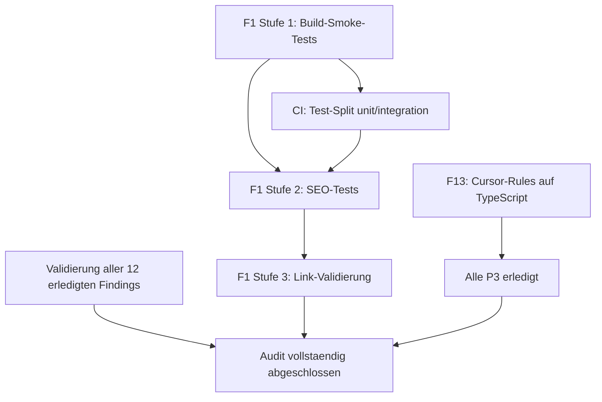

# Implementierungsplan: Kritische Audit-Findings (F1-F14)

Referenz: [docs/technical_audit_report.md](docs/technical_audit_report.md)

---

## Status-Uebersicht

12 von 14 Findings sind bereits vollstaendig umgesetzt. Zwei Findings benoetigen weitere Arbeit:

- **F1 (Tests)**: Vitest konfiguriert, 2 Testdateien vorhanden -- aber Abdeckung ist duenn (nur Data-Integrity- und Config-Tests). Es fehlen Build-Smoke-Tests, SEO-Validierung und Komponenten-Tests.
- **F13 (Cursor-Rules)**: `python-fastapi-basics.mdc` geloescht, Referenz entfernt. Aber alle Code-Beispiele in [.cursor/rules/engineering-principles.mdc](.cursor/rules/engineering-principles.mdc) sind weiterhin Python/FastAPI-Code (ca. 10 Bloecke).

---

## F1: Test-Erweiterung (Hauptarbeit)

### Ist-Zustand

- [vitest.config.ts](vitest.config.ts): Konfiguriert mit Path-Aliases
- [src/config/site.test.ts](src/config/site.test.ts): Prueft Pflichtfelder in `business`, `contact`, `siteMeta`, URL-Formate
- [src/data/data-integrity.test.ts](src/data/data-integrity.test.ts): Prueft alle Daten-Exports (servicePillars, engagementModes, painPoints, timeEntries, pillars, principles, capabilities)
- CI fuehrt `pnpm run test` aus

### Was fehlt (nach Prioritaet)

**Stufe 1 -- Build- und Seiten-Smoke-Tests (hoechste Prio)**

Neuer Test `src/tests/build-smoke.test.ts`:

- Astro-Build programmatisch ausfuehren (`astro build`) und pruefen, dass Exit-Code 0 ist
- ODER: Nach Build `dist/`-Verzeichnis pruefen, dass fuer jede der 8 Seiten eine HTML-Datei existiert:
  - `index.html`, `about/index.html`, `service/index.html`, `workflow/index.html`, `contact/index.html`, `impressum/index.html`, `privacy/index.html`, `404.html`
- Pruefen, dass keine HTML-Datei leer ist (> 1000 Bytes)

Dieser Test ist der wichtigste fehlende Baustein, weil er Regressions beim Build sofort erkennt.

**Stufe 2 -- SEO/Meta-Validierung**

Neuer Test `src/tests/seo.test.ts`:

- HTML-Dateien aus `dist/` parsen (z. B. mit `node-html-parser` oder einfachem Regex)
- Pro Seite pruefen: `<title>` vorhanden, `<meta name="description">` nicht leer, `<link rel="canonical">` korrekte URL, `og:title`/`og:description`/`og:image` vorhanden
- Structured Data (`application/ld+json`) vorhanden und valides JSON
- Kein doppeltes `<title>` Tag

**Stufe 3 -- Link-Validierung**

Test `src/tests/links.test.ts`:

- Alle internen Links (`href="/..."`) aus den HTML-Dateien extrahieren
- Pruefen, dass jeder interne Link auf eine existierende Datei im `dist/`-Ordner verweist
- Externe URLs pruefen, dass sie mit `https://` beginnen

**Stufe 4 -- Komponenten-Tests (nice-to-have)**

- Header.vue: Theme-Toggle-Logik (localStorage-Interaktion), Mobile-Menu-State
- Diese Tests erfordern `@vue/test-utils` und ggf. `happy-dom` -- deutlich mehr Aufwand
- Empfehlung: Zurueckstellen bis es konkreten Bedarf gibt (YAGNI)

### Technischer Ansatz

Die Stufe-1-bis-3-Tests arbeiten alle auf dem `dist/`-Ordner nach dem Build. Das bedeutet:

- Tests koennen als reine Node-Tests laufen (kein Browser noetig)
- CI-Reihenfolge muss angepasst werden: **Build VOR Tests**, damit `dist/` existiert
- Alternativ: Build-Smoke-Tests als separaten CI-Step nach dem Build-Step

Aenderung in [.github/workflows/ci.yml](.github/workflows/ci.yml):

```yaml
# Aktuelle Reihenfolge:
- Run tests # <-- Unit-Tests (Config/Data) laufen VORHER
- Build # <-- Build kommt danach

# Neue Reihenfolge:
- Run unit tests # Config/Data-Tests (brauchen keinen Build)
- Build # Astro-Build erzeugt dist/
- Run integration tests # Build-Smoke, SEO, Links (brauchen dist/)
```

Dafuer brauchen wir zwei Test-Kommandos in [package.json](package.json):

```json
"test": "vitest run",
"test:unit": "vitest run --dir src/",
"test:integration": "vitest run --dir src/tests/"
```

### Akzeptanzkriterien F1

- `pnpm run test` laeuft gruen und prueft mindestens: alle Daten-Exports, Config-Felder, Build-Output fuer alle 8 Seiten, SEO-Metadaten pro Seite
- CI fuehrt beide Test-Stufen aus
- Keine fragilen Tests (keine Snapshots auf volle HTML-Seiten, nur strukturelle Checks)

---

## F13: Cursor-Rules Cleanup

### Ist-Zustand

- `python-fastapi-basics.mdc` existiert nicht mehr
- Referenz in `engineering-principles.mdc` Zeile 196-197 ist bereinigt (verweist nur noch auf `code-style.mdc` und `naming-conventions.mdc`)
- **Aber**: Alle Code-Beispiele (ca. 10 Bloecke, Zeilen 19-175) verwenden Python-Syntax mit Python-spezifischen Konzepten (`AsyncSession`, `Depends`, `Protocol`, `ABC`)

### Loesung

Die Code-Beispiele in [.cursor/rules/engineering-principles.mdc](.cursor/rules/engineering-principles.mdc) auf TypeScript umschreiben:

- KISS-Beispiel: `async function getUserById(...)` statt `async def get_user_by_id(...)`
- SRP-Beispiel: `function validateUserEmail(...)` statt `def validate_user_email(...)`
- OCP-Beispiel: Dependency Injection via Konstruktor-Parameter statt FastAPI `Depends`
- LSP-Beispiel: Composition mit TypeScript Interfaces
- ISP-Beispiel: TypeScript `interface` statt Python `Protocol`
- DIP-Beispiel: TypeScript-Service-Klasse statt FastAPI-Route
- Guardrails-Beispiel: `function calculateTotal(...)` statt `async def calculate_total(...)`

Die Prinzipien bleiben identisch, nur die Sprache der Illustrationen aendert sich.

### Akzeptanzkriterien F13

- Keine Python-Syntax mehr in `.cursor/rules/`
- Alle Beispiele verwenden TypeScript
- Keine Referenzen auf FastAPI, Django, Flask oder andere Python-Frameworks
- Prinzipien und Erklaerungen inhaltlich unveraendert

---

## Validierung aller erledigten Findings

Bevor die Findings als abgeschlossen gelten, sollte jedes einmal systematisch geprueft werden:

**F2 (CI/CD):**

- Push auf Branch, pruefen dass alle 6 CI-Steps gruen laufen
- Absichtlich einen Type-Error einbauen, pruefen dass CI fehlschlaegt

**F3 (CSP) + F4 (HSTS) + F10 (X-XSS-Protection):**

- Nach Deploy: `curl -I https://garten.ai` und Header pruefen
- Oder: securityheaders.com Score pruefen (Ziel: A oder A+)
- CSP in [Caddyfile](Caddyfile) Zeile 14 ist restriktiv, aber `'unsafe-inline'` fuer script-src und style-src ist noetig wegen Astro/Tailwind -- das ist korrekt

**F5 (Caddy-Pin):**

- [Dockerfile](Dockerfile) Zeile 19: `FROM caddy:2.9-alpine` -- geprueft, korrekt

**F6 (pnpm-Sync):**

- [Dockerfile](Dockerfile) Zeile 4 und [package.json](package.json) Zeile 45: beide `10.25.0` -- geprueft, identisch

**F7 (Dependabot):**

- [.github/dependabot.yml](.github/dependabot.yml): npm-Ecosystem mit weekly Schedule und minor/patch Gruppierung -- geprueft, korrekt
- Validierung: Warten bis erster Dependabot-PR fuer npm-Dependency kommt

**F8 (Typo):**

- `grep -r "classDefintion"` im `src/`-Ordner liefert 0 Treffer -- geprueft

**F9 (Unsplash):**

- [src/data/service.ts](src/data/service.ts) verwendet lokale Imports (`architectureImage`, `automationImage`, `enablementImage`) -- geprueft
- Keine `unsplash.com` URLs mehr im `src/`-Ordner
- Keine Preconnect-Hints fuer Unsplash in [src/layouts/BaseLayout.astro](src/layouts/BaseLayout.astro)

**F11 (404-Fallback):**

- [Caddyfile](Caddyfile) Zeile 28: `try_files {path} {path}/ {path}.html /404.html` -- geprueft
- Nach Deploy: `curl https://garten.ai/nonexistent-page` sollte 404-Seite zeigen

**F12 (ESLint):**

- [eslint.config.mjs](eslint.config.mjs): Astro + Vue + TS Plugins konfiguriert -- geprueft
- `pnpm run lint` laeuft fehlerfrei

**F14 (Package-Name):**

- [package.json](package.json) Zeile 2: `"gartenai-homepage"` -- geprueft

---

## Abhaengigkeiten und Reihenfolge



---

## Aufwandsschaetzung

- **F13 (Cursor-Rules)**: ~30 Minuten (mechanische Uebersetzung)
- **F1 Stufe 1 (Build-Smoke)**: ~1 Stunde (Test schreiben + CI anpassen)
- **F1 Stufe 2 (SEO-Tests)**: ~1-2 Stunden (HTML-Parsing, Meta-Checks)
- **F1 Stufe 3 (Link-Validierung)**: ~1 Stunde
- **Validierung aller Findings**: ~30 Minuten (einmaliger Check nach Deploy)
- **Gesamt**: ~4-5 Stunden

---

## Empfohlene Commit-Strategie

- Commit 1: `refactor(rules): rewrite examples in TypeScript` (F13)
- Commit 2: `test(build): add build smoke tests for all pages` (F1 Stufe 1)
- Commit 3: `feat(ci): split unit and integration test steps` (CI-Anpassung)
- Commit 4: `test(seo): validate meta tags and structured data` (F1 Stufe 2)
- Commit 5: `test(links): verify internal link integrity` (F1 Stufe 3)
