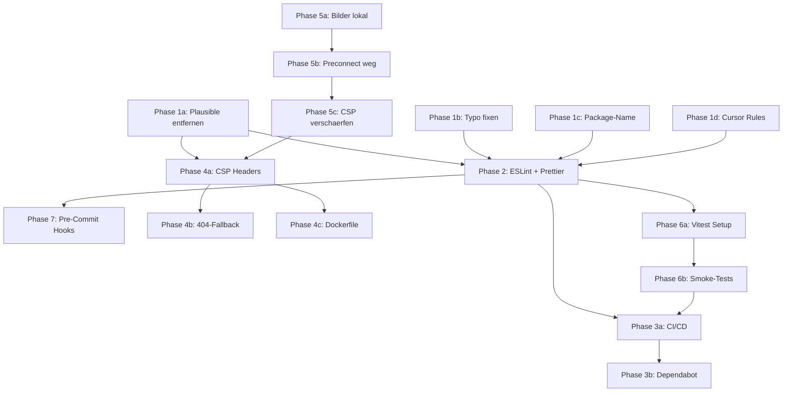

# Quality Excellence Plan

---

## Phase 1: Code-Cleanup (Fundament)

Totes und Fehlerhaftes raus, bevor Tooling draufkommt.

### 1a) Plausible komplett entfernen

Betroffene Dateien:

- [package.json](package.json) -- `@plausible-analytics/tracker` aus dependencies entfernen
- [src/layouts/BaseLayout.astro](src/layouts/BaseLayout.astro) -- Zeilen 155-165 entfernen (Plausible-Script + `__PLAUSIBLE_DOMAIN__` Zuweisung), Zeilen 150-151 entfernen (Unsplash preconnect/dns-prefetch -- gehoert zu Phase 4), Variable `domain` (Z.19) wird nur fuer Plausible genutzt, ebenfalls entfernen
- [src/env.d.ts](src/env.d.ts) -- `__PLAUSIBLE_DOMAIN__` aus Window-Interface entfernen
- [src/components/ConsentToast.astro](src/components/ConsentToast.astro) -- **komplette Datei loeschen** (wird nirgends importiert, ist bereits Dead Code)
- [src/pages/privacy.astro](src/pages/privacy.astro) -- Abschnitt "Plausible Analytics" (Z.626-666) entfernen, Nummerierung der folgenden Abschnitte anpassen
- `pnpm install` ausfuehren um Lock-File zu aktualisieren

### 1b) Typo fixen: `classDefintion` -> `classDefinition`

- [src/layouts/BaseLayout.astro](src/layouts/BaseLayout.astro) Z.22, Z.34
- [src/pages/about.astro](src/pages/about.astro) Z.14
- [src/pages/service.astro](src/pages/service.astro) Z.68

### 1c) Package-Name korrigieren

- [package.json](package.json) Z.2: `"squalid-singularity"` -> `"gartenai-homepage"`

### 1d) Irrelevante Cursor Rules entfernen

- [.cursor/rules/python-fastapi-basics.mdc](.cursor/rules/python-fastapi-basics.mdc) -- loeschen (kein Python im Projekt)
- [.cursor/rules/engineering-principles.mdc](.cursor/rules/engineering-principles.mdc) -- Referenz auf `python-fastapi-basics.mdc` am Ende entfernen

---

## Phase 2: Linting und Formatting

Automatisierte Code-Qualitaetspruefung einrichten.

### 2a) ESLint einrichten

- `pnpm add -D eslint @eslint/js typescript-eslint eslint-plugin-astro eslint-plugin-vue` installieren
- `eslint.config.mjs` erstellen mit Flat Config (ESLint 9):
  - TypeScript-Regeln
  - Astro-Plugin
  - Vue-Plugin (Vue 3 Composition API)
- `"lint": "eslint src/"` Script in [package.json](package.json) ergaenzen
- Initiale Fehler fixen

### 2b) Prettier-Konfiguration explizit machen

- `.prettierrc` erstellen (aktuell laeuft Prettier ohne Config, nur Defaults)
- `.prettierignore` erstellen (dist/, .astro/, pnpm-lock.yaml)
- `"format": "prettier --write src/"` und `"format:check": "prettier --check src/"` Scripts ergaenzen

---

## Phase 3: CI/CD Pipeline

Build-Sicherheit und Quality Gates automatisieren.

### 3a) GitHub Actions Workflow

Datei: `.github/workflows/ci.yml`

Pipeline-Schritte:

1. Checkout
2. pnpm Setup (mit Cache)
3. `pnpm install --frozen-lockfile`
4. `pnpm run check` (TypeScript/Astro)
5. `pnpm run lint` (ESLint)
6. `pnpm run format:check` (Prettier)
7. `pnpm run build` (vollstaendiger Build)

Trigger: Push auf `main` + Pull Requests.

### 3b) Dependabot fuer npm erweitern

[.github/dependabot.yml](.github/dependabot.yml) um npm-Ecosystem ergaenzen:

```yaml
- package-ecosystem: "npm"
  directory: "/"
  schedule:
    interval: weekly
  groups:
    minor-and-patch:
      update-types: ["minor", "patch"]
```

---

## Phase 4: Security und Infrastruktur

### 4a) Caddyfile Security Headers vervollstaendigen

[Caddyfile](Caddyfile) anpassen:

- `Content-Security-Policy` Header ergaenzen (statische Seite, daher restriktiv moeglich: `default-src 'self'; script-src 'self' 'unsafe-inline'; style-src 'self' 'unsafe-inline'; img-src 'self' data:; font-src 'self'` -- nach Unsplash-Entfernung in Phase 5 keine externen Quellen mehr noetig)
- `X-XSS-Protection "1; mode=block"` entfernen (deprecated, potentiell unsicher)
- Pruefen ob Dokploy HSTS setzt -- falls nicht: `Strict-Transport-Security "max-age=31536000; includeSubDomains"` ergaenzen

### 4b) 404-Fallback fixen

[Caddyfile](Caddyfile) Z.27: `try_files {path} {path}/ {path}.html /index.html` aendern zu `try_files {path} {path}/ {path}.html /404.html`

### 4c) Dockerfile haerten

[Dockerfile](Dockerfile):

- Z.4: pnpm-Version von `10.23.0` auf `10.25.0` synchronisieren (muss mit [package.json](package.json) Z.32 uebereinstimmen)
- Z.20: `FROM caddy:alpine` -> `FROM caddy:2.9-alpine` (oder aktuellste stabile Version pinnen)

---

## Phase 5: Unsplash-Bilder lokal hosten

### 5a) Bilder herunterladen und optimieren

- Die 3 Unsplash-URLs aus [src/data/service.ts](src/data/service.ts) (Z.56, 82, 108) herunterladen
- In `src/assets/images/service/` ablegen
- Via Astro `Image`-Komponente einbinden (automatische Optimierung, WebP/AVIF, responsive srcset)
- URLs in `service.ts` durch lokale Asset-Imports ersetzen

### 5b) Preconnect entfernen

- [src/layouts/BaseLayout.astro](src/layouts/BaseLayout.astro) Z.150-151: `preconnect` und `dns-prefetch` fuer `images.unsplash.com` entfernen (keine externen Bild-Quellen mehr)

### 5c) CSP anpassen

- Nach Entfernung der externen Quellen kann die CSP in Phase 4a noch restriktiver werden (kein `img-src` fuer externe Domains)

---

## Phase 6: Testing-Fundament

### 6a) Vitest einrichten

- `pnpm add -D vitest` installieren
- `vitest.config.ts` erstellen (path aliases aus [tsconfig.json](tsconfig.json) uebernehmen)
- `"test": "vitest run"` Script in [package.json](package.json) ergaenzen
- Test-Step in CI-Workflow (Phase 3a) ergaenzen

### 6b) Initiale Tests

Pragmatische Smoke-Tests, kein Overengineering:

- **Config-Test**: `src/config/site.test.ts` -- prueft dass alle Pflichtfelder in `business`, `contact`, `siteMeta` befuellt sind und URLs valide sind
- **Data-Integrity-Tests**: Prueft dass alle Seiten-Daten (service.ts, offer.ts, etc.) keine leeren Strings oder fehlende IDs haben
- **Build-Test**: In CI -- `pnpm run build` ist bereits der wichtigste Smoke-Test (Astro bricht bei fehlenden Imports/Typen ab)

---

## Phase 7: Pre-Commit Hooks

### 7a) Husky und lint-staged einrichten

- `pnpm add -D husky lint-staged`
- `npx husky init`
- `.husky/pre-commit` Hook: `npx lint-staged`
- `lint-staged` Config in [package.json](package.json):

```json
"lint-staged": {
  "*.{astro,vue,ts,js}": ["eslint --fix", "prettier --write"],
  "*.{json,md,css}": ["prettier --write"]
}
```

---

## Zusammenfassung: Erwarteter Endzustand

| Aspekt                  | Vorher                | Nachher                                                  |
| ----------------------- | --------------------- | -------------------------------------------------------- |
| Code-Qualitaet          | Gut (Typo, Dead Code) | Sehr gut (sauber, kein Dead Code)                        |
| Projektstruktur         | Gut                   | Sehr gut (konsistent)                                    |
| TypeScript-Nutzung      | Gut                   | Sehr gut (ESLint-enforced)                               |
| SEO / Structured Data   | Sehr gut              | Sehr gut (unveraendert, war schon stark)                 |
| Accessibility           | Gut                   | Gut (unveraendert -- Verbesserung waere eigenes Projekt) |
| Content-Zentralisierung | Sehr gut              | Perfekt (keine externen Quellen mehr)                    |
| Benennung               | Maengel               | Sehr gut (Typo + Package-Name gefixt)                    |
| Externe Abhaengigkeiten | Fragwuerdig           | Perfekt (keine externen Laufzeit-Dependencies)           |
| Caddyfile / Security    | Luecken               | Sehr gut (CSP, HSTS, korrekter 404-Fallback)             |
| CI/CD                   | Nicht vorhanden       | Sehr gut (Build + Lint + Format + Type-Check)            |
| Testing                 | Nicht vorhanden       | Gut (Smoke-Tests, ausbaufaehig)                          |
| Dependency Management   | Lueckenhaft           | Sehr gut (Dependabot, gepinnte Versionen)                |
| Code-Qualitaets-Tooling | Teilweise             | Sehr gut (ESLint + Prettier + Pre-Commit)                |

---

## Reihenfolge und Abhaengigkeiten



Empfohlene Bearbeitungsreihenfolge: Phase 1 -> 5 -> 2 -> 7 -> 4 -> 3 -> 6
