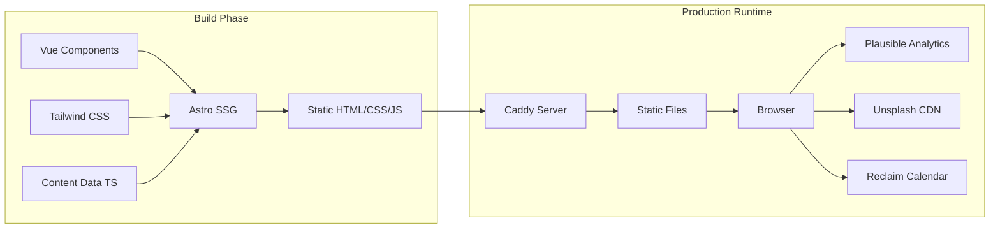

# Technical Audit: garten.ai Homepage

---

## 1) Executive Summary

- **Projekt:** Statische Marketing-/Portfolio-Website fuer Patrik Garten (AI Solution Architect), Zielgruppe deutscher Mittelstand (DACH). Domain: `garten.ai`.
- **Stack:** Astro 5.16 + Vue 3.5 + Tailwind CSS 4.1, TypeScript 5.9, deployed als Docker-Container (Caddy) auf self-hosted Dokploy.
- **Umfang:** ~4.300 LOC in 58 Dateien. 8 Seiten (Homepage, Service, About, Workflow, Contact, Impressum, Datenschutz, 404). Rein statisch, kein Backend, keine Datenbank.
- **Reifegrad:** Fruehes Produktionsstadium. Professionelle Code-Qualitaet, solide SEO-Arbeit, aber **keine Tests, kein CI/CD, kein Error-Tracking, keine Security-Scans**.
- **Kritischste Luecken:** Zero Testabdeckung, fehlende CI/CD-Pipeline, fehlender Content-Security-Policy Header, kein HSTS.
- **Risikobewertung:** Fuer eine statische Marketing-Seite moderat. Keine sensitiven Daten, kein Backend. Hauptrisiko: Regressions durch fehlende Tests und manuelles Deployment.
- **Solo-Entwickler-Projekt:** 184 Commits, ein Contributor, kein Code-Review-Prozess, keine Release-Tags.
- **Technische Schulden:** Typo im Prop-Namen (`classDefintion`), pnpm-Versionsmismatch im Dockerfile, irrelevante Cursor-Rules (Python/FastAPI), veralteter Security-Header (`X-XSS-Protection`).

---

## 2) Projektbeschreibung

**Was ist das?** Persoenliche Website eines freiberuflichen AI Solution Architects. Primaerer Zweck: Lead-Generierung bei deutschen Mittelstaendlern und IT-Dienstleistern. Keine SaaS-Plattform, kein Produkt -- rein Marketing/Portfolio.

**Nutzer:** Potenzielle Kunden (CTOs, IT-Leiter im DACH-Raum), die Beratung fuer KI-Integration/Workflow-Automatisierung suchen.

**Kernfunktion:** Informationsdarstellung (Dienstleistungen, Referenzen, Werdegang) mit Conversion zu Kontaktaufnahme (Calendly/Reclaim-Links, E-Mail, LinkedIn).

**Erfolgskriterien (abgeleitet):** Sichtbarkeit in Suchmaschinen (SEO), professioneller Eindruck, DSGVO-Konformitaet, Uptime.

**Alter:** Repo seit August 2022, aktive Entwicklung bis heute (letzter Commit: 07.02.2026).

---

## 3) Komponenten und Datenfluesse

**Komponenten:**

| Komponente       | Verantwortung                          | Pfad                           |
| ---------------- | -------------------------------------- | ------------------------------ |
| Astro Pages      | Routing, SSG, SEO-Metadaten            | `src/pages/` (8 Seiten)        |
| Vue Components   | Interaktive UI (Header, Theme-Toggle)  | `src/components/Header.vue`    |
| Astro Components | Statische Sections (Hero, CTA, Footer) | `src/components/`              |
| Site Config      | Zentrale Business-/Kontaktdaten        | `src/config/site.ts`           |
| Data Layer       | Seitenspezifische Inhalte              | `src/data/`                    |
| Base Layout      | SEO, Structured Data, Analytics        | `src/layouts/BaseLayout.astro` |
| Caddy            | Webserver, Security Headers, Caching   | `Caddyfile`                    |

**Externe Abhaengigkeiten zur Laufzeit:**

- Plausible Analytics (Privacy-Analytics)
- Unsplash CDN (3 Bilder auf Service-Seite -- hotlinked)
- Reclaim.ai (Terminbuchung)

---

## 4) Stack-Inventar

| Kategorie             | Technologie           | Version         | Status          |
| --------------------- | --------------------- | --------------- | --------------- |
| **Sprache**           | TypeScript            | 5.9.3           | Aktuell         |
| **Framework**         | Astro                 | 5.16.0          | Aktuell         |
| **UI Framework**      | Vue.js                | 3.5.24          | Aktuell         |
| **CSS**               | Tailwind CSS          | 4.1.17          | Aktuell         |
| **Build**             | Vite (via Astro)      | 6.4.1           | Aktuell         |
| **Package Manager**   | pnpm                  | 10.25.0         | Aktuell         |
| **Runtime Node**      | Node.js               | 22-alpine       | LTS             |
| **Webserver**         | Caddy                 | alpine (latest) | Kein Pin!       |
| **Container**         | Docker (Multi-Stage)  | --              | OK              |
| **Deployment**        | Dokploy (self-hosted) | Unbekannt       | --              |
| **Analytics**         | Plausible Tracker     | 0.4.4           | OK              |
| **Icons**             | Heroicons Vue         | 2.2.0           | OK              |
| **UI Primitives**     | Headless UI Vue       | 1.7.23          | OK              |
| **Image Processing**  | Sharp                 | 0.34.5          | OK              |
| **Formatter**         | Prettier              | 3.6.2           | OK              |
| **Linter**            | --                    | --              | **Fehlt**       |
| **Test Framework**    | --                    | --              | **Fehlt**       |
| **CI/CD**             | --                    | --              | **Fehlt**       |
| **Error Tracking**    | --                    | --              | **Fehlt**       |
| **Security Scanning** | --                    | --              | **Fehlt**       |
| **IaC**               | --                    | --              | Nicht vorhanden |

**Fragile/Veraltete Komponenten:**

- `caddy:alpine` ohne Version-Pin -- Production-Image kann sich jederzeit aendern
- `X-XSS-Protection` Header ist deprecated (kann in alten Browsern Vulnerabilities erzeugen)

---

## 5) Arbeitsweise / Prozess

| Aspekt                 | Status                                    | Reifegrad | Evidenz                                |
| ---------------------- | ----------------------------------------- | --------- | -------------------------------------- |
| **Branch-Strategie**   | Nur `main`, kein Feature-Branching        | Niedrig   | `git branch -a`: nur `main`            |
| **Code Review**        | Kein Review-Prozess (Solo-Dev)            | N/A       | 1 Contributor, keine PRs               |
| **Commit-Qualitaet**   | Gut. Conventional Commits, WHY-fokussiert | Hoch      | Git-Log zeigt konsistente Prefixes     |
| **Testing**            | Null. Kein Framework, keine Tests         | Kritisch  | Keine test-Dateien, kein test-Script   |
| **CI/CD**              | Null. Kein Workflow, manuelles Deployment | Kritisch  | Kein `.github/workflows/`              |
| **Release/Versioning** | Keine Tags, Version `0.0.1`               | Niedrig   | `git tag -l` leer, `package.json`      |
| **Dokumentation**      | Guter README, Content-Strategie-Docs      | Mittel    | `README.md`, `docs/`, `description.md` |
| **Coding Standards**   | Dokumentiert in `.cursor/rules/`          | Hoch      | 5+ Rule-Dateien                        |
| **Dependency Updates** | Nur Devcontainer via Dependabot           | Niedrig   | `.github/dependabot.yml`               |
| **Security**           | Runtime-Headers OK, keine Scans           | Niedrig   | Caddyfile, kein SAST/DAST              |
| **Monitoring**         | Nur Plausible (Web-Analytics)             | Niedrig   | Kein Error-Tracking                    |
| **Incident Handling**  | Nicht vorhanden                           | Null      | Keine Runbooks/Postmortems             |

---

## 6) Kritische Findings

| #   | Finding                                 | Kategorie   | Evidenz                                                                             | Impact                                                    | Wahrscheinl. | Fix-Aufwand | Empfehlung                                                   | Prio   |
| --- | --------------------------------------- | ----------- | ----------------------------------------------------------------------------------- | --------------------------------------------------------- | ------------ | ----------- | ------------------------------------------------------------ | ------ |
| F1  | **Keine Tests**                         | Tests       | Kein test-Script in `package.json`, keine `*.test.*` Dateien                        | Regressions unentdeckt                                    | Hoch         | M           | Vitest einrichten, Build-Smoke-Tests zuerst                  | **P1** |
| F2  | **Kein CI/CD**                          | Process     | Kein `.github/workflows/`                                                           | Manuelles Deployment fehleranfaellig, kein Quality Gate   | Hoch         | S           | GitHub Actions: build + type-check                           | **P1** |
| F3  | **Kein Content-Security-Policy Header** | Security    | `Caddyfile` -- kein CSP                                                             | XSS-Risiko (gemindert da statisch)                        | Niedrig      | S           | CSP-Header in Caddyfile ergaenzen                            | **P1** |
| F4  | **Kein HSTS**                           | Security    | Kein `Strict-Transport-Security` in Caddyfile                                       | Downgrade-Attacks moeglich                                | Niedrig      | S           | Pruefen ob Dokploy/Reverse-Proxy HSTS setzt, sonst ergaenzen | **P2** |
| F5  | **Caddy-Image ohne Version-Pin**        | Infra       | `Dockerfile` Zeile 20: `FROM caddy:alpine`                                          | Reproduzierbarkeit nicht gewaehrleistet                   | Mittel       | S           | `FROM caddy:2.9-alpine` (o.ae.)                              | **P2** |
| F6  | **pnpm-Version Mismatch**               | Infra       | Dockerfile: `10.23.0`, package.json: `10.25.0`                                      | Potential lockfile-Inkompatibilitaet                      | Niedrig      | S           | Versionen synchronisieren                                    | **P2** |
| F7  | **Dependabot deckt npm nicht ab**       | Security    | `.github/dependabot.yml`: nur `devcontainers`                                       | Vulnerable Dependencies unentdeckt                        | Mittel       | S           | npm-Ecosystem in Dependabot ergaenzen                        | **P2** |
| F8  | **Typo: `classDefintion**`              | Code        | `BaseLayout.astro` Z.22, `about.astro` Z.14, `service.astro` Z.68                   | Verwirrung, technische Schuld                             | Niedrig      | S           | Rename zu `classDefinition`                                  | **P3** |
| F9  | **Unsplash-Hotlinking**                 | Architektur | `src/data/service.ts` Z.56/82/108                                                   | Externe Abhaengigkeit, Verfuegbarkeitsrisiko, Performance | Mittel       | S           | Bilder lokal hosten oder via Astro Image optimieren          | **P2** |
| F10 | **Deprecated X-XSS-Protection Header**  | Security    | `Caddyfile` Z.12                                                                    | Kann in alten Browsern Vulnerabilities erzeugen           | Niedrig      | S           | Entfernen oder auf `0` setzen                                | **P3** |
| F11 | **SPA-Fallback fuer statische Seite**   | Architektur | `Caddyfile` Z.27: Fallback auf `/index.html`                                        | 404-Fehler zeigen Homepage statt 404-Seite                | Mittel       | S           | Fallback auf `/404.html` aendern                             | **P2** |
| F12 | **Kein Linter (ESLint)**                | Code        | Kein ESLint-Config, keine ESLint-Dependencies                                       | Code-Qualitaet nicht automatisiert geprueft               | Niedrig      | S           | ESLint mit Astro/Vue-Plugin einrichten                       | **P3** |
| F13 | **Irrelevante Cursor-Rules**            | Process     | `.cursor/rules/engineering-principles.mdc` referenziert `python-fastapi-basics.mdc` | Verwirrung, kein Python im Projekt                        | Niedrig      | S           | Python-Referenzen entfernen                                  | **P3** |
| F14 | **Package-Name `squalid-singularity**`  | Code        | `package.json` Z.2                                                                  | Unprofessionell, Verwirrung                               | Niedrig      | S           | Zu `gartenai-homepage` aendern                               | **P3** |

---

## 7) Risiken (Top 5)

| #   | Risiko                                 | Business-Impact                           | Wahrscheinlichkeit       | Mitigation                          |
| --- | -------------------------------------- | ----------------------------------------- | ------------------------ | ----------------------------------- |
| R1  | **Regression durch fehlendes Testing** | Kaputte Seite in Produktion, Lead-Verlust | Hoch (jeder Deploy)      | CI mit Build-Check + visuelle Tests |
| R2  | **Manuelles Deployment versagt**       | Downtime, veralteter Stand in Produktion  | Mittel                   | CI/CD-Pipeline mit Auto-Deploy      |
| R3  | **Unsplash-CDN nicht erreichbar**      | Service-Seite zeigt kaputte Bilder        | Mittel                   | Bilder lokal hosten                 |
| R4  | **Caddy-Update bricht Site**           | Downtime nach Container-Rebuild           | Niedrig-Mittel           | Version-Pin im Dockerfile           |
| R5  | **Bus-Faktor = 1**                     | Komplettes Projektwissen bei einer Person | Inhaerent (Solo-Projekt) | Dokumentation pflegen, ADRs         |

---

## 8) Empfehlungen und Next Actions

### Sofort (0-48h)

| #   | Ziel                     | Konkreter Schritt                                                        | Owner | Akzeptanzkriterium                              |
| --- | ------------------------ | ------------------------------------------------------------------------ | ----- | ----------------------------------------------- |
| A1  | Build-Sicherheit         | GitHub Actions Workflow: `pnpm install && pnpm run build` auf Push/PR    | Dev   | Gruener CI-Check bei jedem Push                 |
| A2  | Caddy-Reproduzierbarkeit | `FROM caddy:alpine` -> `FROM caddy:2.9-alpine` (oder aktuellste stabile) | Dev   | Gepinntes Tag im Dockerfile                     |
| A3  | pnpm-Sync                | Dockerfile pnpm-Version auf `10.25.0` angleichen                         | Dev   | Versionen identisch                             |
| A4  | SPA-Fallback Fix         | `try_files` Fallback von `/index.html` auf `/404.html` aendern           | Dev   | 404-Seite wird bei unbekannten Pfaden angezeigt |

### Kurzfristig (1-2 Wochen)

| #   | Ziel                | Konkreter Schritt                                                                   | Owner | Akzeptanzkriterium                          |
| --- | ------------------- | ----------------------------------------------------------------------------------- | ----- | ------------------------------------------- |
| B1  | Security Headers    | CSP-Header in Caddyfile, HSTS pruefen/ergaenzen, `X-XSS-Protection` entfernen       | Dev   | securityheaders.com Score A+                |
| B2  | Dependency-Scanning | Dependabot um npm-Ecosystem erweitern                                               | Dev   | Dependabot PRs fuer npm-Dependencies        |
| B3  | Unsplash-Entfernung | 3 Bilder lokal hosten, Preconnect-Hints entfernen                                   | Dev   | Keine externen Bild-URLs, keine Preconnects |
| B4  | Typo + Package-Name | `classDefintion` -> `classDefinition`, `squalid-singularity` -> `gartenai-homepage` | Dev   | Saubere Benennung                           |
| B5  | Linter              | ESLint mit `@astrojs/eslint-plugin` und Vue-Plugin einrichten                       | Dev   | `pnpm lint` laeuft fehlerfrei               |

### Mittelfristig (1-2 Monate)

| #   | Ziel                   | Konkreter Schritt                                                           | Owner | Akzeptanzkriterium                              |
| --- | ---------------------- | --------------------------------------------------------------------------- | ----- | ----------------------------------------------- |
| C1  | Test-Fundament         | Vitest einrichten, Smoke-Tests fuer alle Seiten (Build + Rendering)         | Dev   | `pnpm test` prueft alle Seiten auf Build-Fehler |
| C2  | Automated Deployment   | Dokploy-Webhook oder GitHub Actions Deployment-Step                         | Dev   | Push auf `main` deployed automatisch            |
| C3  | Error-Tracking         | Sentry oder aehnliches fuer Production-Fehler                               | Dev   | JS-Errors in Production werden erfasst          |
| C4  | Pre-Commit Hooks       | Husky + lint-staged (Format + Type-Check)                                   | Dev   | Commit wird bei Fehler abgelehnt                |
| C5  | Cursor-Rules aufraumen | Python/FastAPI-Referenzen entfernen, Rules an tatsaechlichen Stack anpassen | Dev   | Rules referenzieren nur Astro/Vue/TS            |

---

## 9) Offene Fragen / Fehlende Evidenz

| #   | Frage                                                                       | Warum relevant                                        | Wie beschaffen                                    |
| --- | --------------------------------------------------------------------------- | ----------------------------------------------------- | ------------------------------------------------- |
| Q1  | Setzt Dokploy/Reverse-Proxy HSTS und TLS-Termination?                       | Bestimmt ob HSTS im Caddyfile noetig ist              | Dokploy-Config / Reverse-Proxy-Config pruefen     |
| Q2  | Gibt es ein Monitoring fuer den Dokploy-Host?                               | Uptime-Sicherheit                                     | Dokploy-Dashboard / Host-Monitoring pruefen       |
| Q3  | Wie wird deployed? Manueller Docker-Build oder Webhook?                     | Deployment-Risiko bewerten                            | Deployment-Prozess dokumentieren                  |
| Q4  | Gibt es Backups des Dokploy-Hosts?                                          | Disaster Recovery                                     | Backup-Strategie pruefen                          |
| Q5  | Warum existieren Python/FastAPI Cursor-Rules?                               | Gibt es ein zweites Projekt oder sind sie irrtümlich? | `.cursor/rules/python-fastapi-basics.mdc` pruefen |
| Q6  | Werden die 2 unpushed Commits (`main` ahead 2) absichtlich zurueckgehalten? | Prod-Stand unklar                                     | `git log origin/main..HEAD` pruefen               |

---

## Gesamturteil

**Fuer das was es ist** -- eine statische Marketing-Seite eines Solo-Freelancers -- ist die Code-Qualitaet solide. Sauberes TypeScript, gute Komponenten-Struktur, vorbildliches SEO-Setup, durchdachte Content-Strategie.

**Die Luecken liegen nicht im Code, sondern im Prozess:** Null Tests, null CI/CD, null Error-Tracking, kein Dependency-Scanning. Das ist fuer eine Solo-Marketing-Seite vertretbar, aber nicht fuer jemanden, der sich als "AI Solution Architect" mit Governance-Fokus positioniert. Die eigene Website sollte die proklamierten Standards widerspiegeln.

**Dringendster Handlungsbedarf:** CI/CD-Pipeline (30 Minuten Aufwand) eliminiert das groesste Risiko (kaputtes Deployment) und ist Voraussetzung fuer alles Weitere.
